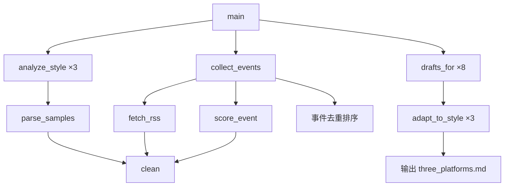

# News-Setup 代码 Wiki

> 最后更新：2026-09-04\
> 语言：Python 3\
> 入口文件：[multi\_platform\_desk.py](multi_platform_desk.py)

***

## 1. 项目概述

**News-Setup** 是一个**三平台热点事件文案生成工具**。它从公开 RSS 源抓取加密货币 / AI 相关新闻，根据事件相关性打分筛选，再为 X（Twitter）、币安广场、OKX 星球三个平台各生成一套风格化文案草稿。

核心定位：**"热点事件 → 三平台文案"**（见文件顶部注释）。

***

## 2. 项目结构

```
news-setup/
├── multi_platform_desk.py      # 唯一入口脚本（单文件应用）
├── samples/                    # 平台风格样本（用于分析写作习惯）
│   ├── _meta.csv               # 样本元数据索引（含乱码字符，格式见下）
│   ├── biance.txt              # 币安广场热门文案样本
│   ├── okx.txt                 # OKX 星球热门文案样本
│   └── x.txt                   # X/Twitter 热门文案样本
├── output/                     # 运行产出生成的目录
│   └── three_platforms.md      # 最终输出的 Markdown 报告
└── README.md                   # （可选）项目说明
```

***

## 3. 模块职责

由于本项目是**单文件脚本**，模块按**功能内聚**划分，而非物理文件划分。

### 3.1 常量层

| 常量           | 用途                                                                  |
| ------------ | ------------------------------------------------------------------- |
| `NEWS_FEEDS` | 5 个 RSS 源 URL（CoinDesk、Cointelegraph、The Block、Decrypt、OpenAI Blog） |
| `KEYWORDS`   | 两类标签关键词：`crypto`（10词）和 `ai`（8词）                                     |
| `SKIP`       | 过滤词表，命中则丢弃该条目（ giveaway / airdrop code / 保证收益 等）                    |

### 3.2 数据模型

| 类                             | 职责                              |
| ----------------------------- | ------------------------------- |
| [Event](#331-event-dataclass) | 新闻条目：标题、摘要、URL、相关度分数、标签列表       |
| [Style](#332-style-dataclass) | 平台写作风格画像：平均长度、表情/代币/问句使用率、前几句样例 |

### 3.3 功能层

| 函数                 | 职责                                             | 所在逻辑阶段   |
| ------------------ | ---------------------------------------------- | -------- |
| `clean()`          | 去除 HTML 标签、URL、多余空白                            | 预处理      |
| `fetch_rss()`      | 向 RSS 源发请求，解析 XML，返回 (title, desc, link) 三元组列表 | 数据采集     |
| `score_event()`    | 对一条新闻打分并标注标签                                   | 事件评估     |
| `collect_events()` | 收集所有 RSS、打分、去重、排序，返回 Top 8                     | 事件采集     |
| `parse_samples()`  | 读取 `samples/` 下的 .txt 文件，分割成独立文案段落             | 风格学习（输入） |
| `analyze_style()`  | 统计样本的字数/表情/代币符号/问句频率，构造 `Style` 对象             | 风格学习（分析） |
| `adapt_to_style()` | 根据 `Style` 特征给基础文案做风格适配（追加 $ticker、问句、截断）      | 文案适配     |
| `drafts_for()`     | 根据事件类型生成三平台的原始文案模板                             | 文案生成     |
| `main()`           | 编排以上所有步骤，输出 `output/three_platforms.md`        | 主控流程     |

***

## 4. 关键类与函数详细说明

### 4.1 Event dataclass

```python
@dataclass
class Event:
    title: str      # 新闻标题
    summary: str    # 摘要（截断至 280 字符）
    url: str        # 原文链接
    score: float    # 相关度分数（越高越重要）
    tags: list[str] # 标签，如 ["crypto", "ai"]
```

**生成路径：** [fetch\_rss()](multi_platform_desk.py#L61) → [score\_event()](multi_platform_desk.py#L82) → [collect\_events()](multi_platform_desk.py#L100)

### 4.2 Style dataclass

```python
@dataclass
class Style:
    name: str          # 平台标识："x" / "binance" / "okx"
    avg_len: int       # 样本中位数字数
    emoji_rate: float  # 含 Emoji 的文案占比（0~1）
    ticker_rate: float # 含 $/＃ 代币符号的文案占比
    question_rate: float # 含问号的文案占比
    first_lines: list[str]  # 前 8 条文案的首句（各截取 40 字符）
```

**默认值**（当样本文件不存在时）：`avg_len=180, emoji=0.1, ticker=0.3, question=0.2, first_lines=[]`

### 4.3 fetch\_rss(url: str) -> list\[tuple\[str, str, str]]

- **HTTP 请求**：GET 指定 URL，超时 20 秒，携带自定义 `User-Agent`

- **XML 解析**：兼容 RSS 2.0（`<item>`）和 Atom（`<entry>`）两种格式

- **去重截取**：最多取前 25 条

- **异常处理**：任何异常静默打印警告并返回空列表

### 4.4 score\_event(title, summary) -> tuple\[float, list\[str]]

评分规则（累加制）：

- 命中任意 `SKIP` 词 → 立即返回 `(0, [])`

- 每命中一个关键词 +1 分

- 同时命中 `crypto` 和 `ai` 两个标签 → 额外 +2.5 分

- 命中 `"clarity" / "etf" / "agent" / "regulation" / "payment"` 任一 → 额外 +1.5 分

**阈值**：`score >= 2` 才保留为有效事件。

### 4.5 collect\_events() -> list\[Event]

完整流程：

1. 遍历全部 `NEWS_FEEDS`，调用 `fetch_rss()`
2. 对每条结果调用 `score_event()`
3. 保留 `score >= 2` 的事件
4. 按分数降序排列
5. 按标题前 40 字符去重（保留第一条）
6. 返回 Top 8

### 4.6 parse\_samples(path: Path) -> list\[str]

- 以空行（`\n\n`）分割文件内容，得到若干文案段落

- 对每段调用 `clean()`，保留长度 > 20 的段落

- 样本文件格式：以 `===` 开头的元数据块 + 空行 + 文案正文（`biance.txt` 等）

### 4.7 analyze\_style(name, posts) -> Style

统计指标：

- `avg_len`：样本长度的**中位数**

- `emoji_rate`：含 Unicode Emoji（`\U0001F300-\U0001FAFF`）的段落比例

- `ticker_rate`：含 `$` 或 `＃` 或 `#` 的段落比例

- `question_rate`：含 `？` 或 `?` 的段落比例

- `first_lines`：每段第一个 `。` 之前的内容（最多 8 条，每条 ≤ 40 字）

### 4.8 adapt\_to\_style(base: str, style: Style, platform: str) -> str

风格适配规则：

| 条件                               | 动作                 |
| -------------------------------- | ------------------ |
| `ticker_rate > 0.4` 且正文不含 `$BTC` | 末尾追加 `\n$BTC $ETH` |
| `question_rate > 0.3` 且正文不含 `？`  | 末尾追加 `\n你怎么看？`     |
| `platform == "x"`                | 仅保留前 8 行           |
| `platform == "okx"` 且长度 > 480    | 截断至 470 字符并追加 `…`  |

### 4.9 drafts\_for(event, styles) -> dict\[str, str]

根据事件标签选择 `why` 段落，然后填充三个模板：

**X 模板：**

```
{fact}

{why}

我现在只盯两个验证点：
1）有没有可重复的数据，而不是单日情绪
2）讨论是在讲机制，还是只在讲价格

不是投资建议。
```

**币安广场模板：**

```
先说结论：{fact}

对交易者更有用的问题不是"看涨还是看跌"，而是这件事改变了哪一层：
- 监管清晰度
- 资金准入
- 还是产品叙事

{why}

我会继续跟踪原新闻里的关键变量，而不是追一条标题。
数据来源：公开报道。以上为个人观察，不构成投资建议。
$BTC $ETH
```

**OKX 星球模板：**

```
刚刷到：{fact}

星球里这类消息最容易被做成口号。我更想先问一句：
盘面上有没有同步变化，还是只有社交热度？

{why}

我先观察，不急着加仓或改方向。
#OKX星球话题来啦
$BTC
```

`why` 的三段式分支：

- `crypto ∩ ai` → "AI 能力变化，会不会改变链上交易、支付或安全假设"

- `ai` only → "加密行业的外溢：交易执行、代理支付、还是攻击面变大"

- `crypto` only → "把'已发生的事实'和'市场正在定价的预期'分开"

### 4.10 main() -> None

主控编排：

1. 加载并分析三个平台的风格样本
2. 收集 Top 8 事件
3. 为每个事件生成三平台文案
4. 拼装为 Markdown 文档，写入 `output/three_platforms.md`
5. 打印简要日志

***

## 5. 依赖关系

### 5.1 外部依赖

| 包          | 用途            | 来源   |
| ---------- | ------------- | ---- |
| `requests` | HTTP 请求获取 RSS | PyPI |

> 该项目仅使用标准库 + requests，无其他第三方依赖。

### 5.2 内部调用图



### 5.3 数据流向

```
RSS 源（5个）───fetch_rss──→ 原始条目
                                │
                          score_event
                                ▼
                          Event 列表（≥score 2）
                                │
                          collect_events（去重+排序+Top8）
                                │
                         drafts_for（按标签选模板）
                                ├──→ X 文案
                                ├──→ 币安广场 文案
                                └──→ OKX 星球 文案
                                │
                          adapt_to_style（风格微调）
                                │
                                ▼
                       output/three_platforms.md
```

***

## 6. 运行方式

### 6.1 前置要求

- Python 3.10+（使用了 `list[str]` 等现代类型注解语法）

- 安装 `requests`：`pip install requests`

### 6.2 运行命令

```bash
cd d:\AI-auto\news-setup
python multi_platform_desk.py
```

### 6.3 输入

将热门账号的文案样本放入 `samples/` 目录：

- `samples/x.txt` — X（Twitter）风格样本

- `samples/biance.txt` — 币安广场风格样本（注意文件名拼写为 `biance`）

- `samples/okx.txt` — OKX 星球风格样本

文件格式：以 `===` 分隔的元数据块 + 空行 + 文案正文（见 `samples/` 下现有文件示例）。

### 6.4 输出

运行后生成 `output/three_platforms.md`，格式如下：

```markdown
# 三平台选题台 2026-09-04 14:24 UTC

## 1. 新闻标题
- 分数：9.0 ｜ 标签：crypto, ai
- 链接：https://...

### X
（文案内容）

### 币安广场
（文案内容）

### OKX星球
（文案内容）

---
```

### 6.5 控制台输出

```
已生成 output/three_platforms.md
风格样本： {'x': 42, 'binance': 180, 'okx': 70}
```

***

## 7. 配置说明

### 7.1 可调整的新闻源

修改 [NEWS\_FEEDS](multi_platform_desk.py#L20-L26) 列表，添加或移除 RSS URL。

### 7.2 可调整的关键词

修改 [KEYWORDS](multi_platform_desk.py#L28-L31) 字典，扩展或收窄标签范围。

### 7.3 可调整的过滤词

修改 [SKIP](multi_platform_desk.py#L33) 列表，增加或减少屏蔽词。

### 7.4 评分阈值

[collect\_events](multi_platform_desk.py#L105) 中 `score >= 2` 是保留阈值，可酌情调整。

### 7.5 输出条数

[collect\_events](multi_platform_desk.py#L116) 末尾 `[:8]` 限制最多 8 条事件，可修改。

***

## 8. 已知局限

1. **文案风格模板固定**：`drafts_for()` 中的文案骨架是硬编码的，未接入 LLM，风格适配仅靠规则追加（`adapt_to_style`），与样本真实风格的匹配度有限。
2. **样本解析粗糙**：`parse_samples()` 仅按双换行分割，不区分元数据块和正文，`_meta.csv` 中部分字段存在编码问题。
3. **无增量更新**：每次运行重新抓取所有 RSS，无缓存机制，可能触发目标站点的速率限制。
4. **错误处理薄弱**：`fetch_rss` 吞掉所有异常仅打印，上层无感知。
5. **单文件架构**：随着功能扩展，建议拆分为多模块以提高可测试性。

***

## 9. 扩展建议

| 方向     | 建议                                                 |
| ------ | -------------------------------------------------- |
| 架构拆分   | 将 `fetch_rss`、`score_event`、`drafts_for` 等拆为独立模块   |
| LLM 集成 | 在 `drafts_for` 阶段接入大模型，替代硬编码模板                     |
| 缓存层    | 对 RSS 响应做本地缓存，避免重复拉取                               |
| 测试覆盖   | 为 `score_event`、`adapt_to_style` 等纯函数添加单元测试        |
| 配置外置   | 将 `NEWS_FEEDS`、`KEYWORDS`、`SKIP` 移至 YAML/JSON 配置文件 |

